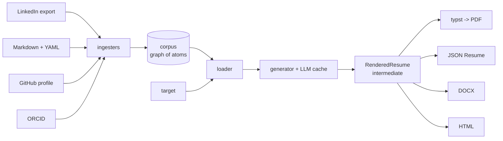

# tool_cv_corpus

Schema-driven, LLM-assisted engine that compiles a **graph-of-atoms**
career corpus into job-targeted CVs, resumes, and cover letters.

[](https://github.com/iam6ft7in/tool_cv_corpus/actions/workflows/ci.yml)
[](LICENSE)
[](https://www.python.org/downloads/)

## Why

Most resume tooling treats a CV as a document you edit. Every new
target becomes a rewrite, the sourcing behind each bullet gets lost,
and one-off prose mixes with data you wanted to re-use.

`tool_cv_corpus` inverts the model:

1. Your **corpus** is structured, sourced career data with provenance.
2. A **target** is a job posting you are applying to.
3. The engine **resolves** corpus against target, scores claims by
   fit, applies visibility rules, and emits a format-agnostic
   `RenderedResume`.
4. Pluggable **renderers** turn it into PDF (Typst), JSON Resume,
   DOCX, or HTML.

## Pipeline



## Quick start

```bash
uv add tool-cv-corpus
cv-corpus doctor                       # verify install
cv-corpus init my_career               # scaffold a corpus
cv-corpus validate my_career           # run 11 checks
cv-corpus schema --out schemas/        # export JSON Schemas
```

Try the bundled synthetic example:

```bash
cv-corpus validate examples/corpus_jordan_taylor
```

## Entity kinds

`person`, `organization`, `role`, `project`, `achievement`, `skill`,
`education`, `publication`, `artifact`, `testimonial`,
`cover_letter_seed`, `target`, `source_doc`. Plus `Claim` records
layered on top for sourced assertions.

See [docs/architecture/schema.md](docs/architecture/schema.md) for
the design invariants.

## Plugins

Three entry-point groups discover renderers, ingesters, and LLM
providers at install time:

- `tool_cv_corpus.renderers` - `typst`, `json_resume`, `docx`, `html`
- `tool_cv_corpus.ingesters` - `markdown`, `linkedin_export`,
  `github_profile`, `orcid`
- `tool_cv_corpus.llm_providers` - `anthropic`, `openai` (stub)

Write your own: see
[docs/plugin_authoring/index.md](docs/plugin_authoring/index.md).

## Configuration

| Variable                 | Effect                                    |
|--------------------------|-------------------------------------------|
| `CV_CORPUS_SOURCE_STORE` | Override CAS root (default: platformdirs) |
| `CV_CORPUS_MODEL`        | Override default LLM model                |
| `ANTHROPIC_API_KEY`      | Anthropic provider auth                   |
| `OPENAI_API_KEY`         | OpenAI provider auth (stub)               |

## Status

Version 0.1.0 ships the schema, CLI surface, validator with 11
ordered checks, the default plugin set, CI matrix across
3 OS x 2 Python versions, and trusted-publishing release wiring.

The claim-scoring and target-aware generation phases are stubs;
contributions welcome.

## Contributing

Read [CONTRIBUTING.md](CONTRIBUTING.md) and
[code_of_conduct.md](code_of_conduct.md) first. Conventional commits
and SSH-signed commits are required for maintainers; contributors
can open PRs without signing and a maintainer will squash-merge.

## License

Apache 2.0. See [LICENSE](LICENSE).
